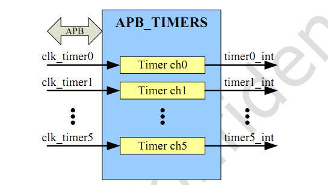
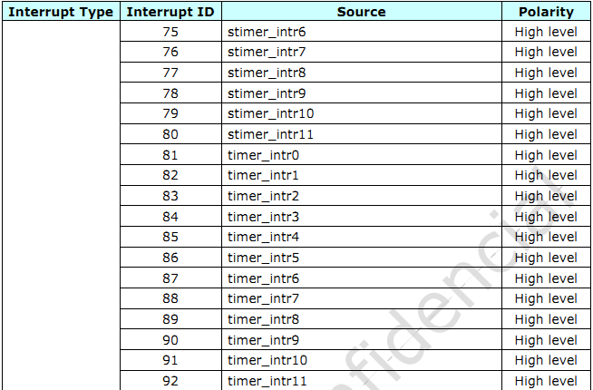
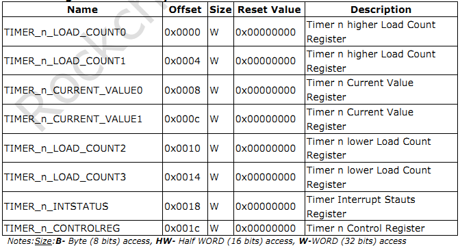

# TIMER 使用

## 前言

RK3399有12 个Timers (timer0-timer11)，有12 个Secure
Timers(stimer0~stimer11) 和 2 个Timers(pmutimer0~pmutimer1)， 我们主要
用到的是Timers(timer0-timer11)时钟频率为24MHZ ，工作模式有 free-
running 和 user-defined count 模式

## 框架图

## 工作模式

user-defined count：Timer 先载入初始值到 TIMERn_LOAD_COUNT3 和
TIMER_LOADn_COUNT2寄存器， 当时间累加的值在寄存器TIMERn_LOAD_COUNT1和
TIMERn_LOAD_COUNT0时，将不会自动载入到计数寄存器。 用户需要重新关闭计
数器和然后重新设置计数器相关才能继续工作。

free-running：Timer先载入初始值到TIMER_LOAD_COUNT3 和
TIMER_LOAD_COUNT2寄存器， 当时间累加的值在寄存器TIMERn_LOAD_COUNT1和
TIMERn_LOAD_COUNT0时，Timer将一直自动加载计数寄存器。

## 软件配置

1.在 dts 文件中定义 Timer 的相关配置
kernel/arch/arm64/boot/dts/rockchip/rk3399.dtsi

	rktimer: rktimer@ff850000 {
		 compatible = "rockchip,rk3399-timer";
		 reg = <0x0 0xff850000 0x0 0x1000>;
		 interrupts = <GIC_SPI 81 IRQ_TYPE_LEVEL_HIGH 0>;
		 clocks = <&cru PCLK_TIMER0>, <&cru SCLK_TIMER00>;
		 clock-names = "pclk", "timer";
	};

其中定义的Timer0 的寄存器和中断号和时钟等

其他Timer 对应的中断号可看如下图片

2.对应的驱动文件Kernel/drivers/clocksource/rockchip_timer.c

## 对应寄存器和使用

1.寄存器如下图片

2.使用方式 查看对应寄存器

	root@rk3399_firefly_box:/ # io -4 0xff85001c  //查看当前控制寄存器的状态
	ff85001c:  00000007

	root@rk3399_firefly_box:/ # io -4 0xff850000  //查看寄存器时时的值
	ff850000:  0001639f

控制对应寄存器

	root@rk3399_firefly_box:/ # io -4 -w 0xff85001c 0x06  //关闭时间计数功能
